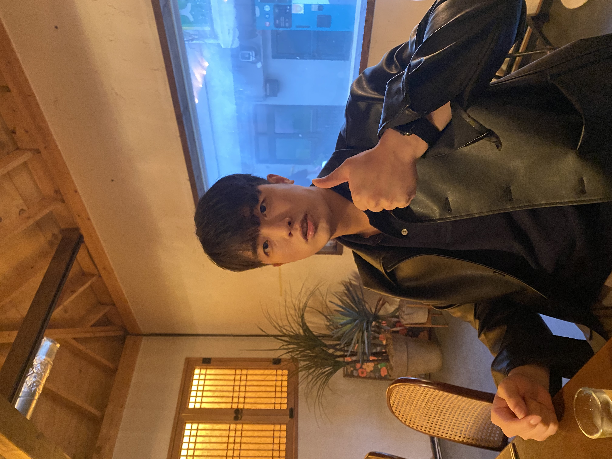

# 👋 Hi, I'm Woosik Kim

> "First, solve the problem. Then, write the code."

Welcome to my page! I'm a **Computer Science student at UC San Diego** who enjoys building practical, meaningful projects and learning through real problem-solving.

---

## 📋 Contents

- [About Me](#-about-me)
- [My Skills](#-my-skills)
- [Projects](#-projects)
- [Activities](#-activities)
- [Goals](#-goals)
- [Contact](#-contact)

---

## 🙋 About Me

I'm a **Computer Science major at UC San Diego**, and I transferred from **El Camino College**, where I graduated with a strong academic record and continued building my interest in technology.

Before coming to the U.S., I worked in **operations and materials management** at an electronics company in Korea. That experience taught me how important systems, organization, and reliability are in real-world environments. Over time, it also pushed me to become more interested in computing, problem solving, and technology that can make processes smarter and more efficient.

Now, I'm especially interested in **software development, AI-related tools, security, and large-scale systems**. I like projects that are not just technical, but also useful to real people.

---

## 💻 My Skills

### Languages

- **Comfortable with:** C++, Python, Java, JavaScript
- **Currently learning more about:** TypeScript, React, system design, AI tools

### Tools & Technologies

1. Git & GitHub
2. VS Code
3. Linux / Bash
4. React / Next.js
5. Node.js
6. Google Apps Script
7. Google Vertex AI

---

## 🚀 Projects

### Compose X

An AI-powered Gmail add-on project built through a team development experience.  
The project includes features such as **AI reply suggestions, smart composition, email summarization, and calendar event extraction**.

I contributed to the development process with a focus on **calendar-related functionality, implementation support, and collaboration across the team**.

### ShowBrand Research Project

A research-oriented project exploring how AI systems can identify products and brands from uploaded images.

This project is especially interesting to me because it goes beyond just “making it work.” It also looks at **reliability, uncertainty, and how errors from external AI tools can affect the overall system**, which connects to my growing interest in secure and trustworthy software.

### Course Projects

Through my coursework, I've built projects involving **data structures, algorithms, object-oriented programming, and system-level problem solving**. I enjoy learning by building, debugging, and improving code step by step.

---

## 🌱 Activities

- **MESA** — Supported beginner students in coding and computer science
- **Core Consulting Group (CCG)** — Participated in a student organization working with small businesses and real-world problem solving
- **LikeLion at UCSD** — Took part in project-based development and collaborative building
- **Research / Faculty Mentor Program** — Working on research that connects AI systems with practical software design questions

---

## ✅ Goals

### Right Now
- [x] Keep strengthening my CS fundamentals
- [x] Build more practical project experience
- [ ] Deepen my experience in software engineering and AI-related development
- [ ] Continue improving my portfolio and technical communication

### Long Term
- [ ] Land a strong software engineering or IT-related internship
- [ ] Build systems that are reliable, scalable, and useful in the real world
- [ ] Grow at the intersection of software, AI, security, and impactful technology

---

## 📚 A Thought I Like

> Good programmers do not just make things work.  
> They make things understandable, reliable, and useful.

---

## 📬 Contact

Feel free to connect with me!
- Email: `wok017@ucsd.edu`

- GitHub: [github.com/woosik-study](https://github.com/woosik-study)

- LinkedIn: [https://www.linkedin.com/in/woosikkim-ucsd/](https://www.linkedin.com/in/woosikkim-ucsd/)